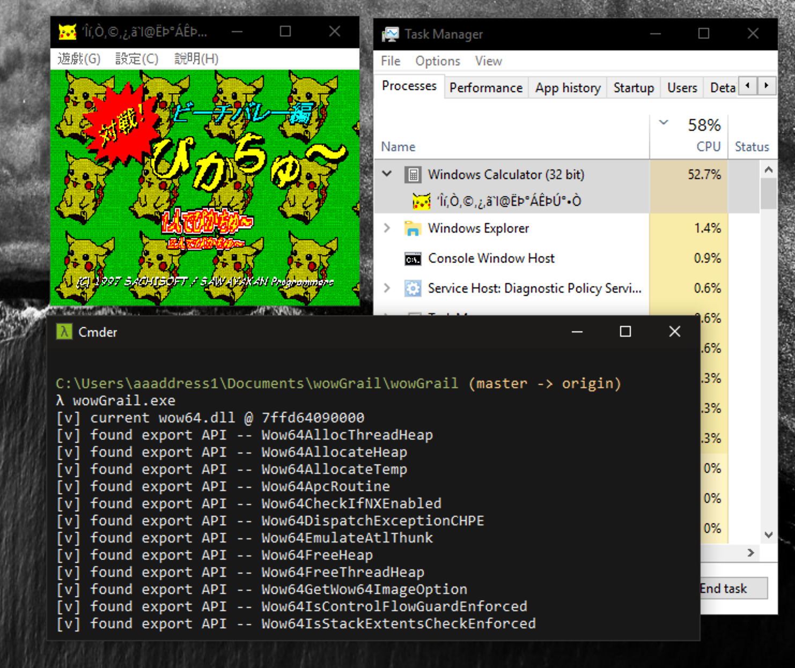

# wowGrail

Rebuild a new to Abuse the conversion layer embedded in WOW64(Windows 32 on Windows 64), that makes malware able to launch 32-bit NTAPI interrupts, and bypass Antivirus agents in no time.

It's a proof-of-concept of the talk of HITB 2021. There are more details about reversing the whole WOW64 layer by Microsoft and abuse, see *[Rebuild The Heaven's Gate: from 32 bit Hell back to Heaven Wonderland](https://conference.hitb.org/hitbsecconf2021ams/sessions/wow-hell-rebuilding-heavens-gate/)*.

**HIGHLY RECOMMEND** 

Compile It in Release mode, if you're using MSVC toolchain. Due to MSVC's performance instrumentation in Debug mode, there'll be an unexpected memory layout.

