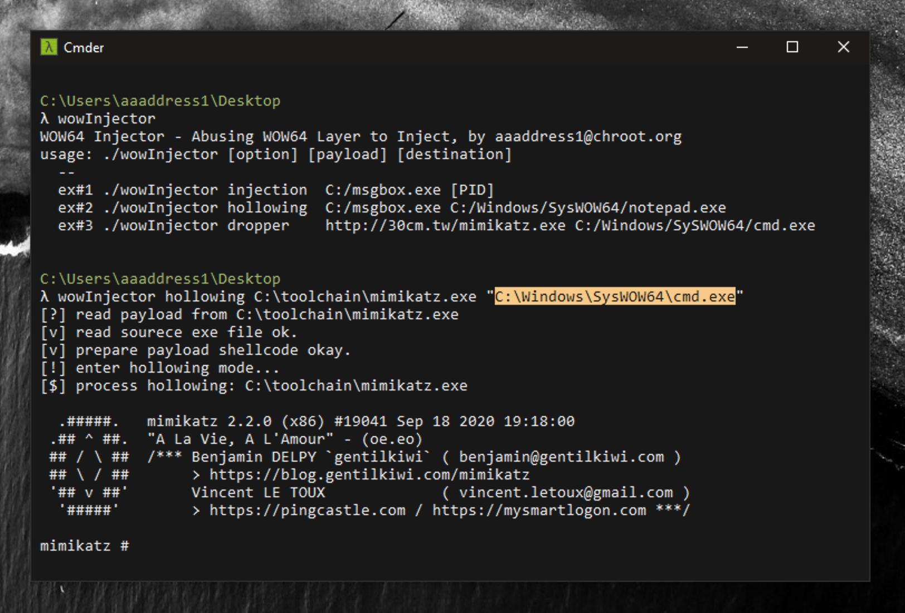

# wowInjector

Inject payload to WOW64(Windows 32 on Windows 64) process via exploit 32-bit thread snapshot. This trick makes us possible to do malicious attacks and bypass Antivirus agents at the same time, e.g. Injection, Hollowing, Dropper, etc.

It's a proof-of-concept of the talk of HITB 2021. There are more details about reversing the whole WOW64 layer by Microsoft and abuse, see *[Rebuild The Heaven's Gate: from 32 bit Hell back to Heaven Wonderland](https://conference.hitb.org/hitbsecconf2021ams/sessions/wow-hell-rebuilding-heavens-gate/)*.

